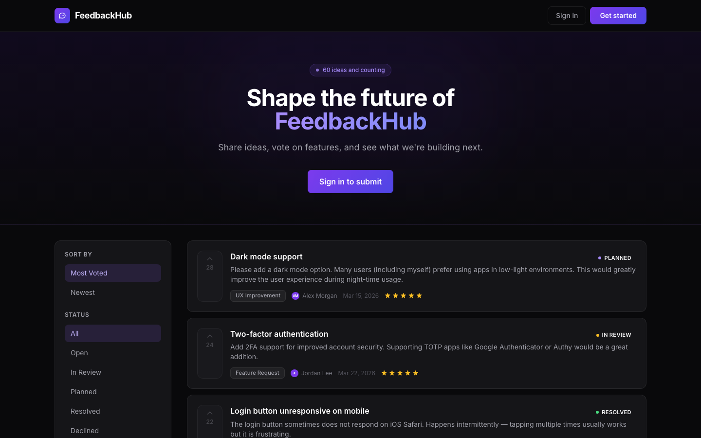
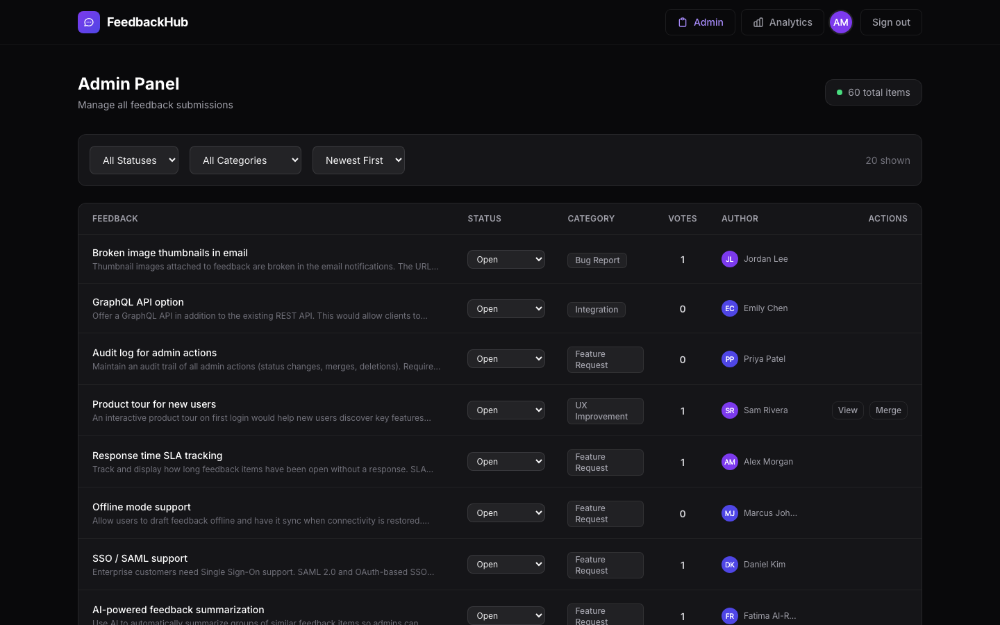
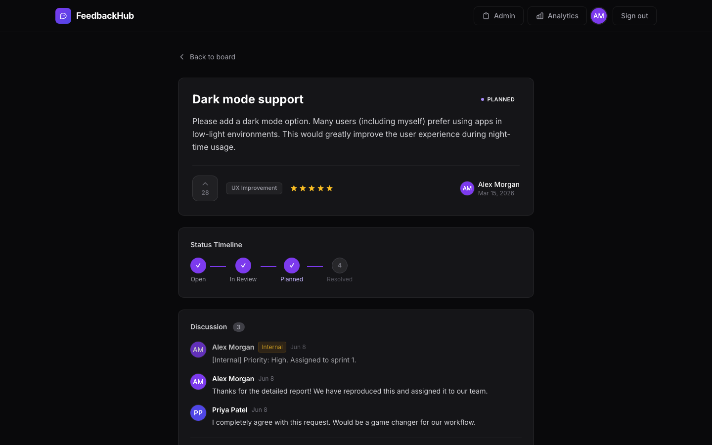
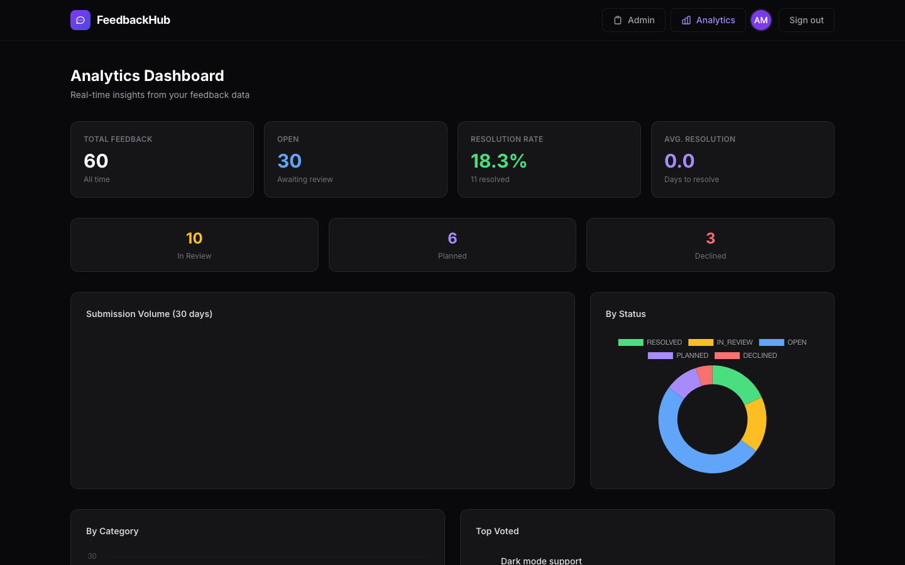
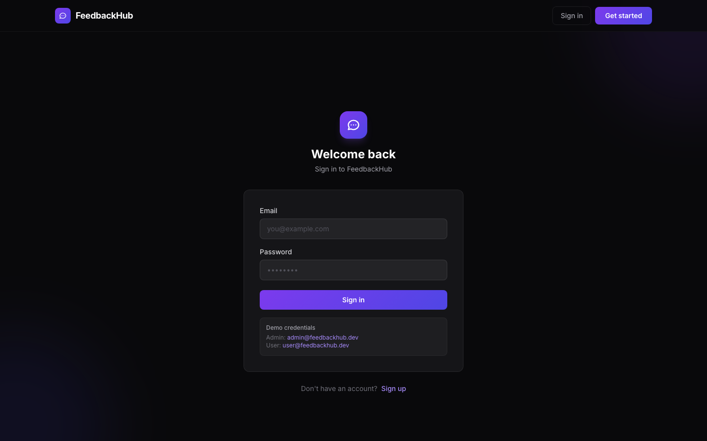

<picture>
  
</picture>

<h1 align="center">FeedbackHub</h1>

<p align="center">
  <strong>A premium, full-stack feedback management system.</strong><br>
  Submit ideas · vote on features · track what gets built.
</p>

<p align="center">
  
  
  
  
  
  
</p>

<p align="center">
  <a href="https://arafatomer66.github.io/feedback-mgmt">🌐 Live Demo</a> ·
  <a href="#-quick-start">Quick Start</a> ·
  <a href="#-features">Features</a> ·
  <a href="#-api-reference">API</a>
</p>

---

## Screenshots

| Board | Admin Panel |
|---|---|
|  |  |

| Feedback Detail | Analytics Dashboard |
|---|---|
|  |  |

| Login |
|---|
|  |

---

## Features

### For Users
- **Feedback board** — Browse, filter by status/category, sort by votes or newest
- **Submit feedback** — Title, description, category, star rating via a slide-up modal
- **Upvoting** — One vote per user per item, optimistic UI, instant toggle
- **Detail view** — Full description, status timeline stepper, comment thread
- **Comments** — Public discussion on any feedback item

### For Admins
- **Admin panel** — Sortable data table of all items with inline status dropdowns
- **Status workflow** — `Open → In Review → Planned → Resolved / Declined`
- **Merge feedback** — Combine duplicate submissions
- **Analytics dashboard** — KPI cards, 30-day volume chart, by-status donut, by-category bar, top-voted list
- **Internal notes** — Private comments only visible to admins

### Platform
- JWT authentication (access token, 7-day expiry)
- Role-based access control (`USER` / `ADMIN`)
- 60 seeded feedback items with realistic vote/comment distribution across 90 days
- Dark-first UI — glassmorphism cards, violet→indigo gradient, Inter font
- Fully paginated API with filtering and sorting

---

## Tech Stack

| Layer | Technology |
|---|---|
| Frontend | Angular 19 (standalone components), Tailwind CSS 3, Chart.js |
| Backend | NestJS 11, Passport JWT, class-validator |
| Database | PostgreSQL 16, TypeORM 1.0 |
| Auth | JWT Bearer tokens, bcrypt password hashing |
| Dev DB | Docker Compose (Postgres) or local Postgres.app |

---

## Quick Start

### Prerequisites
- Node.js 20+
- PostgreSQL running locally (or Docker)

### 1. Clone & install

```bash
git clone https://github.com/arafatomer66/feedback-mgmt.git
cd feedback-mgmt

cd backend && npm install
cd ../frontend && npm install
```

### 2. Configure the backend

```bash
cd backend
cp .env.example .env
# Edit .env — set DATABASE_URL to your local Postgres
```

Default `.env`:
```env
DATABASE_URL=postgresql://<your-user>@localhost:5432/feedbackhub
JWT_SECRET=supersecretjwtkey_changeme
PORT=3000
```

Create the database:
```bash
psql -U $(whoami) -c "CREATE DATABASE feedbackhub;"
```

### 3. Run

**Terminal 1 — Backend (with auto-seed):**
```bash
cd backend
AUTO_SEED=true npm run start:dev
```

**Terminal 2 — Frontend:**
```bash
cd frontend
npm start
```

Open **http://localhost:4200**

---

## Demo Credentials

| Role | Email | Password |
|---|---|---|
| Admin | `admin@feedbackhub.dev` | `Admin123!` |
| User | `user@feedbackhub.dev` | `User123!` |

> The seed runs automatically on first boot (`AUTO_SEED=true`). It is idempotent — runs only when the database is empty.

---

## Project Structure

```
feedback-mgmt/
├── backend/                  # NestJS API
│   └── src/
│       ├── auth/             # JWT auth, guards, decorators
│       ├── feedback/         # CRUD, filtering, pagination
│       ├── votes/            # Toggle upvote
│       ├── comments/         # Public + internal notes
│       ├── analytics/        # Aggregation queries
│       ├── users/            # User management
│       └── seed/             # 60-item demo dataset
└── frontend/                 # Angular 19 SPA
    └── src/app/
        ├── core/             # AuthService, ApiService, interceptors, guards
        ├── features/
        │   ├── auth/         # Login + register pages
        │   ├── board/        # Feedback board + submit modal
        │   ├── detail/       # Feedback detail + comments
        │   ├── admin/        # Admin panel + status workflow
        │   └── dashboard/    # Analytics + charts
        └── shared/           # Navbar, Toast, StatusBadge components
```

---

## API Reference

### Auth
```
POST /api/auth/register   { name, email, password }
POST /api/auth/login      { email, password }
```

### Feedback
```
GET    /api/feedback               ?page&limit&status&category&sort
GET    /api/feedback/:id
POST   /api/feedback               { title, description, category, rating }  🔒
PATCH  /api/feedback/:id/status    { status }                                 🔒 Admin
PATCH  /api/feedback/:id/assign    { assignee_id }                            🔒 Admin
POST   /api/feedback/:id/merge     { target_id }                              🔒 Admin
```

### Votes
```
POST /api/votes/:feedbackId        (toggle)  🔒
```

### Comments
```
GET  /api/comments/:feedbackId
GET  /api/comments/:feedbackId/all           🔒
POST /api/comments/:feedbackId     { body, is_internal }  🔒
```

### Analytics
```
GET /api/analytics/overview        🔒 Admin
GET /api/analytics/volume          ?days=30  🔒 Admin
GET /api/analytics/breakdown       🔒 Admin
GET /api/analytics/top-voted       ?limit=10  🔒 Admin
```

---

## Seed Data

The seed populates:

| Resource | Count |
|---|---|
| Admin users | 3 |
| Regular users | 15 |
| Feedback items | 60 |
| Votes | ~200 |
| Comments | ~40 |

Feedback spans **6 categories**, **5 statuses**, and **90 days** of history for realistic chart curves.

To reseed:
```bash
psql -U $(whoami) -c "DROP DATABASE feedbackhub; CREATE DATABASE feedbackhub;"
cd backend && AUTO_SEED=true npm run start:dev
```

---

## Deployment

### Backend → Railway

1. New project → Deploy from GitHub → root `/backend`
2. Add env vars: `DATABASE_URL`, `JWT_SECRET`, `AUTO_SEED=true`, `NODE_ENV=production`
3. Add a free Postgres from [neon.tech](https://neon.tech) as `DATABASE_URL`

### Frontend → GitHub Pages

```bash
cd frontend
npm run build -- --base-href=/feedback-mgmt/ --configuration=production
npx angular-cli-ghpages --dir=dist/frontend/browser
```

Live: **https://arafatomer66.github.io/feedback-mgmt**

---

## License

MIT — built by [@arafatomer66](https://github.com/arafatomer66)
